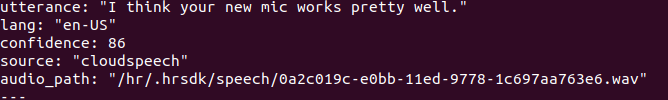

# Grace_API

Output specification: 

(1) ASR Sentence: complete sentence reported by the asr module of Grace published to a ros topic 

        Topic name: /hr/perception/hear/sentence 

        Message Type: hr_msgs/ChatMessage 

        Message Format: 

            string utterance    #This is the text string of the sentence 

            string lang         #Language code 
        
            uint8 confidence    #Confidence level reported by ASR 

            string source       #Provider of the ASR service 

            string audio_path   #Cached audio file path 

        Sample: 

             

(2) ASR Stream - Word: word stream reported by the asr module of Grace published to a ros topic - note that this stream could be unstable as ASR module is dynamically revising its judgements on words

        Topic name: /hr/perception/hear/words

        Message Type: hr_msgs/ChatMessage

        Message Format:

            string utterance    #This is the text string of an individual word 

            string lang         #Language code

            uint8 confidence    #Confidence level reported by ASR

            string source       #Provider of the ASR service

            string audio_path   #Cached audio file path 

        Sample: (Note the revision of the word "see")
        
            

Input specification:

